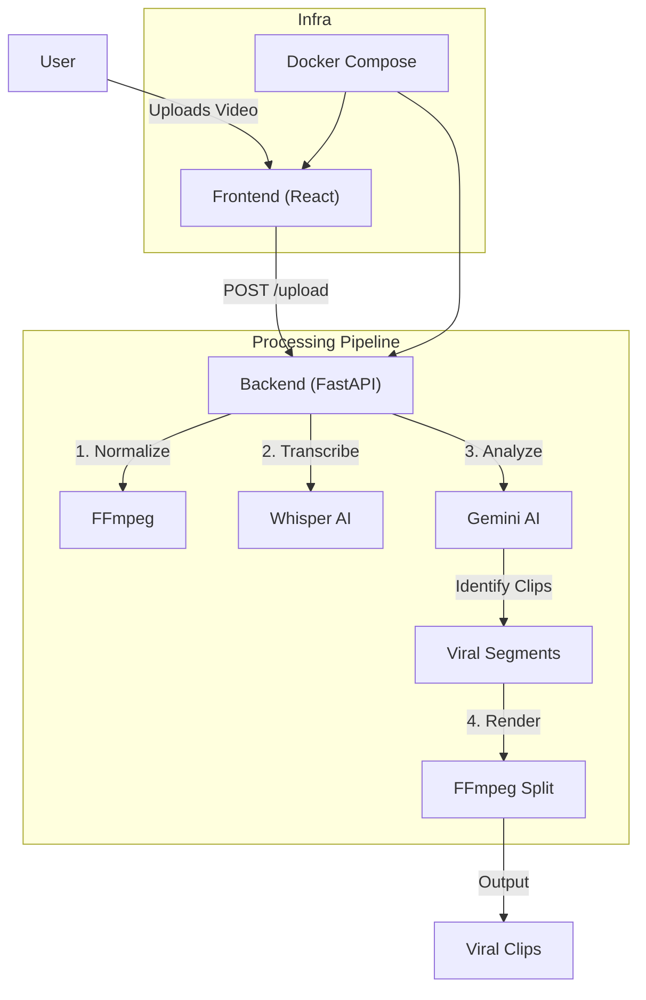

# Cursor for Tiktok 🎥 ✨

Your AI-powered video editor for creating viral TikTok clips!

This project automatically transcribes videos, identifies viral moments using Gemini AI, and provides a sleek web interface for editing and thumbnail generation.


## 🏗 Architecture



## 🚀 Getting Started

### Docker Quickstart (Recommended)

1. Clone the repo:
   ```bash
   git clone https://github.com/yourusername/viral-clips-crew.git
   cd viral-clips-crew/new_app
   ```
2. Set your API Key in `docker-compose.yml` or create a `.env` file.
3. Run with Docker Compose:
   ```bash
   docker-compose up --build
   ```
4. Open [http://localhost:5173](http://localhost:5173).

### Manual Setup

### Prerequisites
- Python 3.10+
- Node.js & npm
- FFmpeg (must be installed and in your PATH)
- Google Gemini API Key

### Backend Setup

1. Navigate to the backend directory:
   ```bash
   cd backend
   ```
2. Create virtual environment:
   ```bash
   python -m venv venv
   source venv/bin/activate  # On Windows: venv\Scripts\activate
   ```
3. Install dependencies:
   ```bash
   pip install -r requirements.txt
   ```
4. Set up environment variables:
   Create a `.env` file in `backend/` and add:
   ```env
   GEMINI_API_KEY=your_api_key_here
   ```
5. Run the server:
   ```bash
   uvicorn main:app --reload --port 8001
   ```

### Frontend Setup

1. Navigate to the frontend directory:
   ```bash
   cd frontend
   ```
2. Install dependencies:
   ```bash
   npm install
   ```
3. Start the dev server:
   ```bash
   npm run dev
   ```
4. Open [http://localhost:5173](http://localhost:5173) in your browser.

## 🛠 Features

- **Auto-Viral Clips**: Automatically analyze videos to find the most engaging segments.
- **AI Text-Based Editing**: Edit videos by querying the transcript (e.g., "Remove fillers", "Keep the funny part").
- **Smart Thumbnails**: Generate viral thumbnails using AI and snapshots from your video.
- **Split Screen**: Create split-screen reactions or gameplay overlays easily.

## 🤝 Contributing

Contributions are welcome! Please feel free to submit a Pull Request.

## 📄 License

This project is licensed under the MIT License - see the [LICENSE](LICENSE) file for details.
