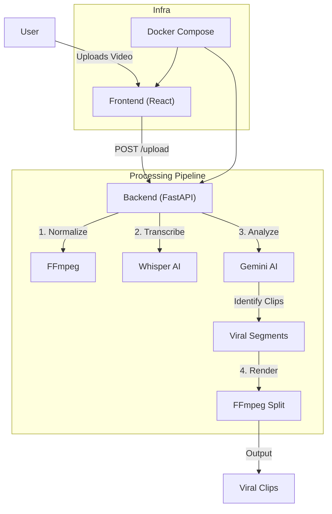

# Cursor for Tiktok 🎥 ✨

Your AI-powered video editor for creating viral TikTok clips!

This project automatically transcribes videos, identifies viral moments using Gemini AI, and provides a sleek web interface for editing and thumbnail generation.


## 🏗 Architecture



## 🚀 Getting Started

### Docker Quickstart (Recommended)

1. Clone the repo:
   ```bash
   git clone https://github.com/ArvinAIEngineer/Cursor-For-Tiktok-Videos--Open-Source.git
   cd Cursor-For-Tiktok-Videos--Open-Source
   ```
2. **Set up Environment**:
   *   Open `docker-compose.yml`.
   *   Replace `your_api_key_here` with your actual Google Gemini API Key.
   *   *Note*: Ensure you have a `.env` file in **both** the root directory (for Docker) and the `backend/` directory (for manual development).
   *   Run:
       ```bash
       docker-compose --env-file .env up --build
       ```
3. **Run with Docker Compose**:
   ```bash
   docker-compose --env-file .env up --build
   ```
4. Open [http://localhost:5173](http://localhost:5173).


### Manual Setup

### Prerequisites
- **Python 3.10 or 3.12** (required for CrewAI and auto viral clips). Use [pyenv](https://github.com/pyenv/pyenv) and run `pyenv install 3.12` then `pyenv local 3.12`, or install Python 3.12 from python.org.
- Node.js & npm
- FFmpeg (must be installed and in your PATH)
- Google Gemini API Key

### Backend Setup

1. Navigate to the backend directory:
   ```bash
   cd backend
   ```
2. Create virtual environment with **Python 3.10 or 3.12** (required for auto viral clips):
   ```bash
   # Install Python 3.12 if needed: brew install python@3.12  (macOS) or pyenv install 3.12
   python3.12 -m venv venv
   # or: python3.10 -m venv venv
   source venv/bin/activate  # On Windows: venv\Scripts\activate
   ```
   If you had an existing `venv` created with Python 3.9, remove it (`rm -rf venv`) and recreate with 3.10+.
3. Install dependencies:
   ```bash
   pip install -r requirements.txt
   ```
4. Set up environment variables:
   Create a `.env` file in `backend/` and add:
   ```env
   GEMINI_API_KEY=your_api_key_here
   ```
5. Run the server:
   ```bash
   uvicorn main:app --reload --port 8001
   ```

### Frontend Setup

1. Navigate to the frontend directory:
   ```bash
   cd frontend
   ```
2. Install dependencies:
   ```bash
   npm install
   ```
3. Start the dev server:
   ```bash
   npm run dev
   ```
4. Open [http://localhost:5173](http://localhost:5173) in your browser.

## ✅ Testing all features

After starting backend (Python 3.10+) and frontend:

1. **Upload** a video (e.g. a 1–2 min clip) and wait for transcription and snapshot.
2. **Media library** should show correct size (MB), duration, and thumbnail.
3. **Create TikTok Video** (auto-generate): each viral segment is exported as a **single vertical clip** (version1.mp4, version2.mp4, …) from the raw footage—no split-screen.
4. **Timeline**: Add clips and **Export**; works even when some clips have no audio.
5. **AI Edit**: Use prompts that work with the video only (e.g. vertical 9:16, slow motion). Avoid effects that need external images; use the editing prompt (e.g. “Make it vertical 9:16”) on a video; paths are under the files directory.

## 📋 Functional requirements (current)

- **Upload**: Accept video uploads up to **4 hours** in length. Supported formats: **MP4, MOV, AVI, WebM** (and MP3 for audio). Files are normalized/transcoded to a standard format for processing.
- **Viral clip suggestions**: **5–15 clip suggestions per hour** of source content, ranked by predicted virality. Each clip is 10–20 seconds (min 3 s, max 30 s).
- **Auto-reframe**: Clips are auto-reframed from source aspect ratio to **vertical 9:16** for TikTok. Subject tracking (e.g. face-aware framing) is not yet implemented; current behavior is center crop/scale.
- **Scene detection**: Current pipeline uses **transcript + Gemini** to identify viral moments. Multimodal scene detection (audio energy, transcript sentiment, visual motion, face detection) is planned for future work.

## 🛠 Features (current)

- **One-click viral flow**: Onboarding upload + **description/concept** → transcribe, Gemini (concept-aware viral picks), Crew (timestamps), export one 9:16 clip per viral moment. Also **Create TikTok Video** from the editor on any upload.
**Auto-Viral Clips**: Analyze the transcript with Gemini, 
get segment timestamps with Crew, and export **one vertical 
clip per viral moment** (trimmed from the raw footage, 
9:16). Each clip gets its own thumbnail; viral clips are 
labeled in the library.
- **Timeline**: Single-track editor with playhead, zoom, **magnetic snapping** (ruler + clip edges), trim handles, split at playhead, drag to reorder/move in time. **Keyframes** for position, scale, rotation (add at playhead with or without selecting a clip; cyan = selected clip, orange = unselected).
- **Export**: Render timeline → **browser download** (FileResponse, no separate download step).
- **Canvas**: 9:16 preview, pan/zoom/rotate, safe-area guides; transforms and keyframes drive export.
- **AI text-based editing**: Prompt-driven edits (trim, crop, speed, etc.) on files in the project.
- **Thumbnails**: Gemini 2.5 Flash Image for viral thumbnail generation.
- **Split screen**: Top/bottom timelines and export.

---

## To do & further considerations

- **Subject tracking** for perfect long→short cuts (e.g. face-aware framing instead of center crop).
- **Transitions / effects** (cross-dissolve, wipes, etc.).
- **Captions** (burn-in or exportable).
- **B-roll** (cutaways, overlay clips).

---

## 🤝 Contributing

Contributions are welcome! Please feel free to submit a Pull Request.

## 📄 License

This project is licensed under the MIT License - see the [LICENSE](LICENSE) file for details.
